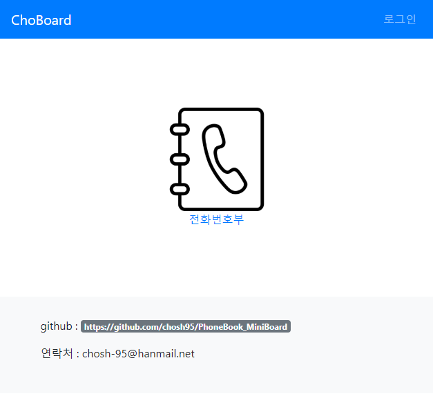
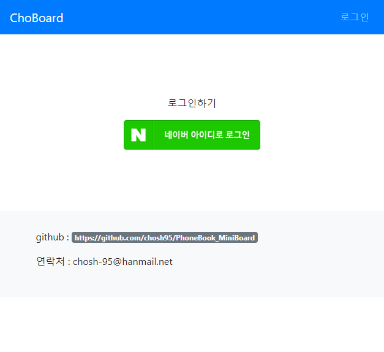
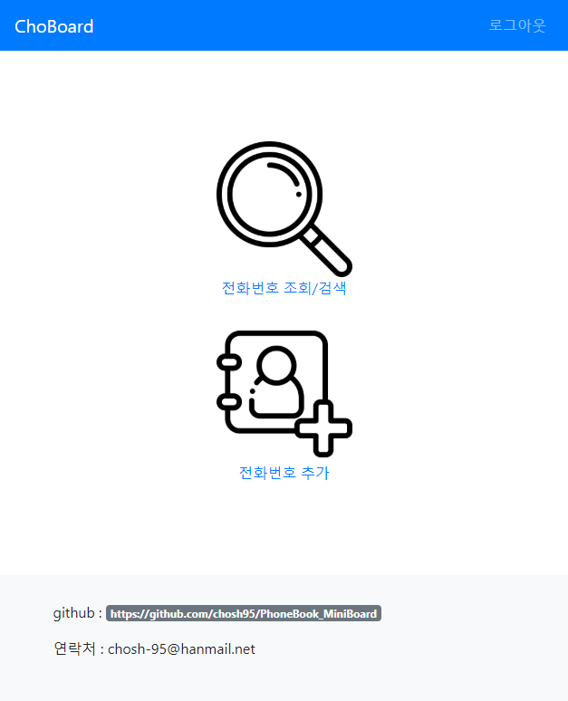
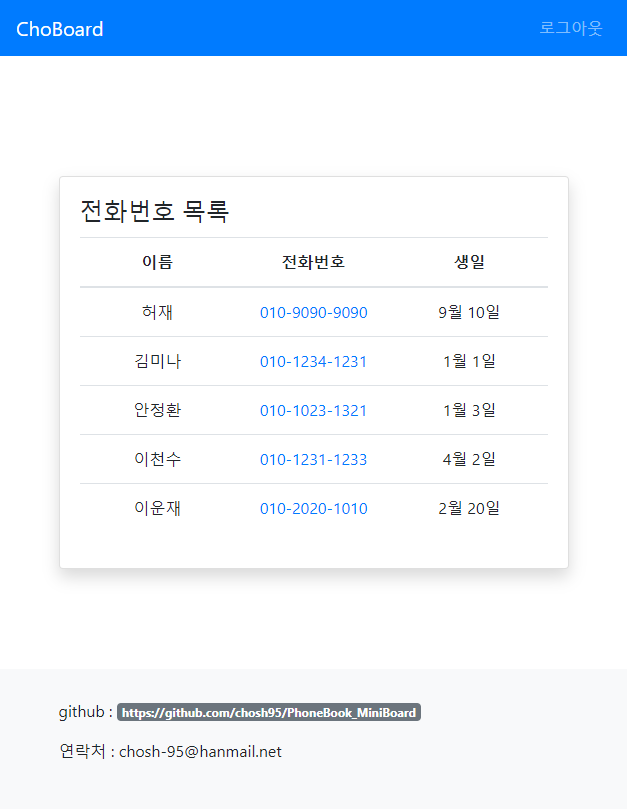
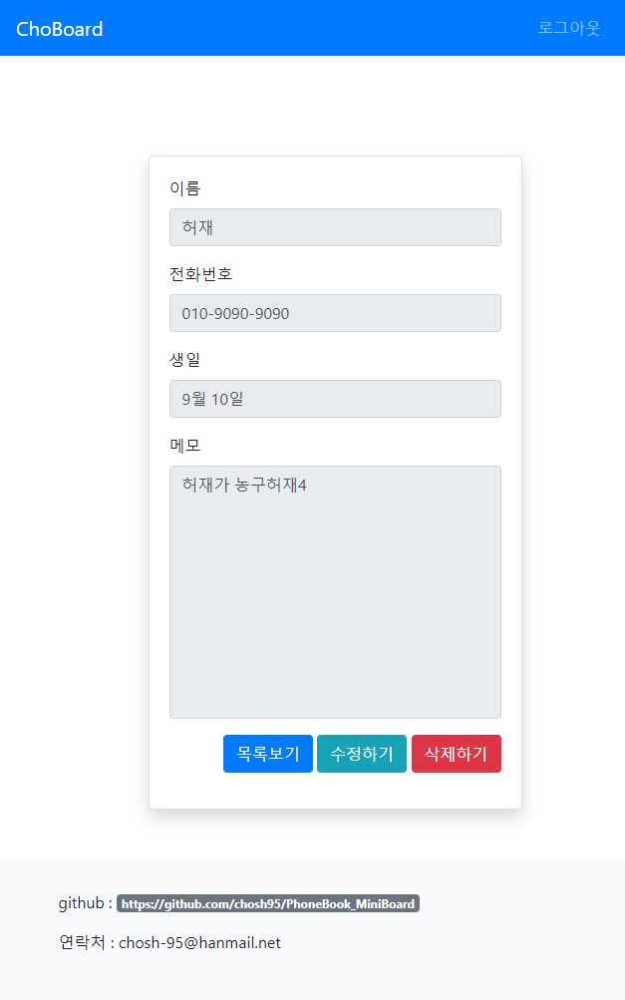
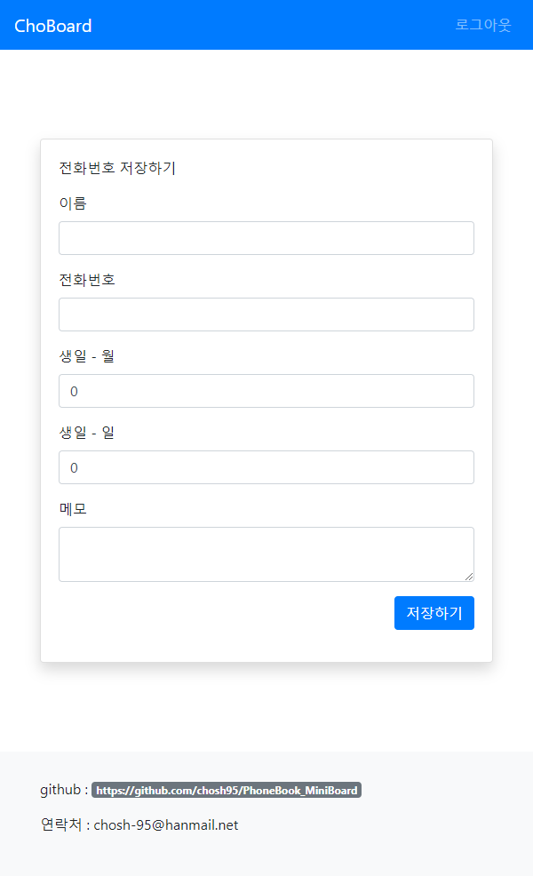

# 전화번호부 게시판 미니 프로젝트

## 사용기술 : HTML & Bootstrap4 & Java & SpringMVC & OracleDB

## 사용예시
1. 메인화면

2. 네이버 로그인

3. 전화번호부 메인 페이지

4. 전화번호 조회

로그인한 사람이 저장한 전화번호만 조회가 가능하다.

5. 전화번호 상세정보

6. 전화번호 추가

